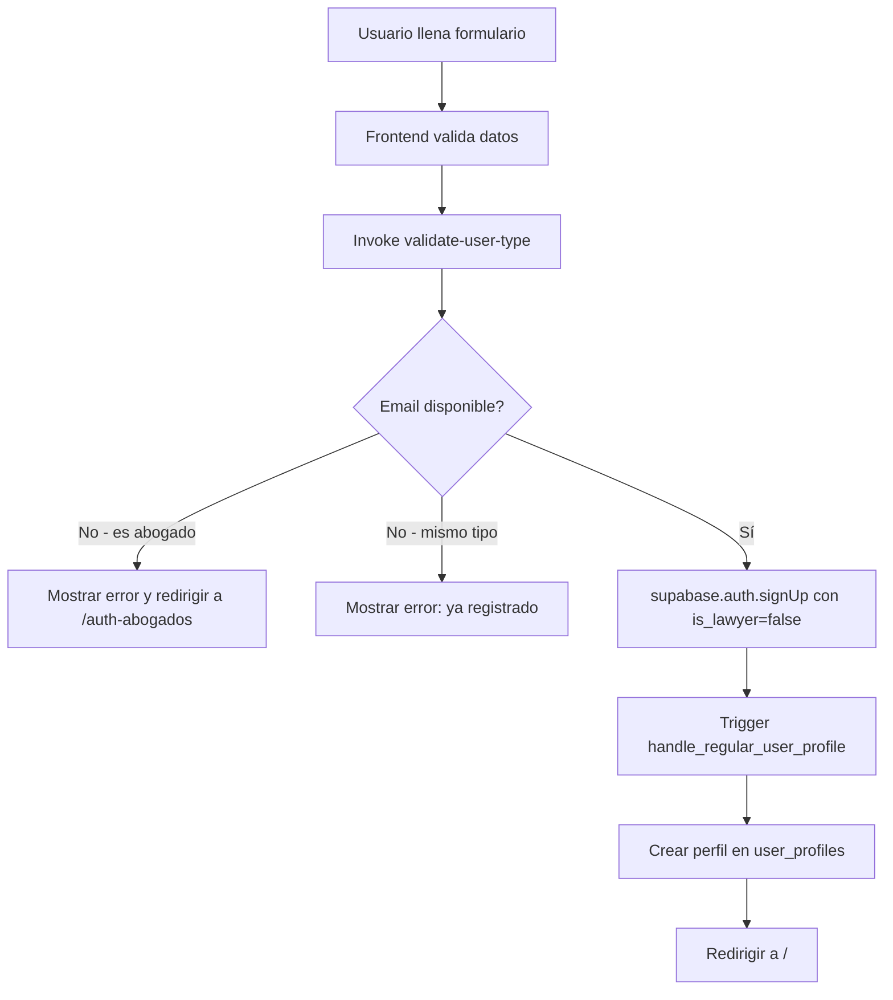
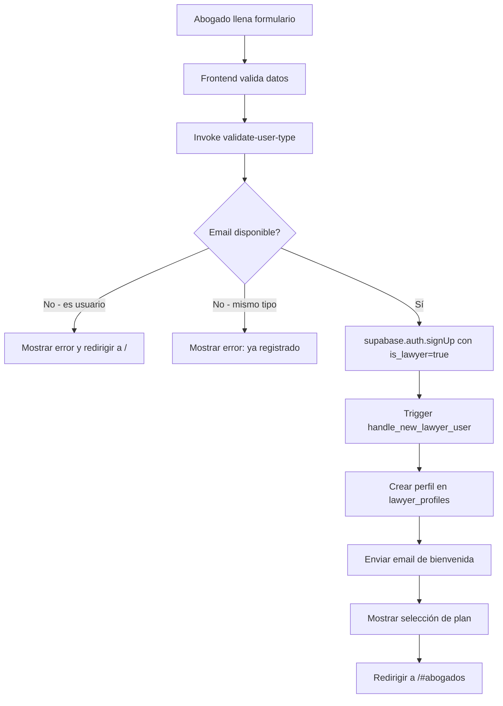
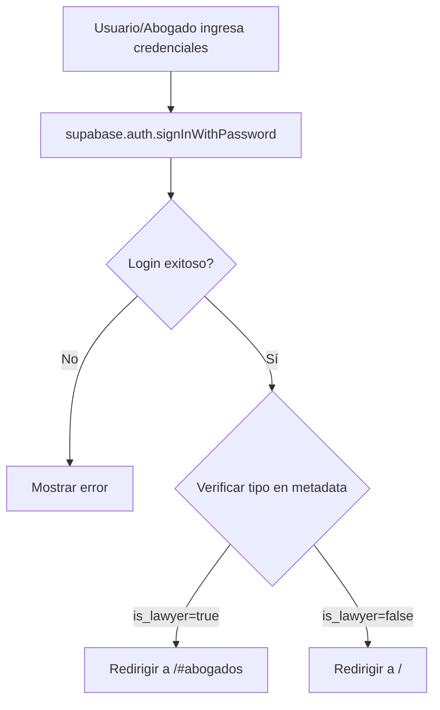

# Estructura de Autenticación y Acceso a Paneles

## Resumen
Este documento describe la arquitectura de autenticación y acceso a paneles para usuarios y abogados en la plataforma.

## Principios de Seguridad

### 1. Separación Estricta de Tipos de Usuario
- **Un abogado NO puede registrarse como usuario**
- **Un usuario NO puede registrarse como abogado**
- **Cada email está asociado a UN SOLO tipo de usuario**

### 2. Validación en Múltiples Capas

#### Capa 1: Validación de Frontend
**Archivos:**
- `src/components/UserAuthPage.tsx` (líneas 72-165)
- `src/hooks/useLawyerAuth.ts` (líneas 173-201)

**Proceso:**
Antes de llamar a `supabase.auth.signUp()`, se invoca la función edge `validate-user-type`:

```typescript
const { data: validationData } = await supabase.functions.invoke('validate-user-type', {
  body: {
    email: email.trim().toLowerCase(),
    requestedType: 'user' // o 'lawyer'
  }
});

if (!validationData.canRegister) {
  // Mostrar error y redirigir al login correcto si existe con otro tipo
  return;
}
```

#### Capa 2: Edge Function - validate-user-type
**Archivo:** `supabase/functions/validate-user-type/index.ts`

**Validaciones que realiza:**
1. Verifica si el email existe en `auth.users` y compara el tipo
2. Verifica si existe en `lawyer_profiles` cuando se intenta registrar como usuario
3. Verifica si existe en `user_profiles` cuando se intenta registrar como abogado
4. Retorna error específico con URL de redirección si hay conflicto

**Respuestas posibles:**
```typescript
// Puede registrarse
{
  canRegister: true,
  message: 'Email disponible para registro'
}

// No puede registrarse - conflicto de tipo
{
  canRegister: false,
  error: 'Este email ya está registrado como [tipo]',
  existingType: 'user' | 'lawyer',
  loginUrl: '/' | '/auth-abogados'
}

// No puede registrarse - ya existe del mismo tipo
{
  canRegister: false,
  error: 'Este email ya está registrado',
  shouldLogin: true
}
```

#### Capa 3: Triggers de Base de Datos
**Archivos de migración:**
- `handle_new_lawyer_user()` - Trigger para crear perfiles de abogados
- `handle_regular_user_profile()` - Trigger para crear perfiles de usuarios

**Funcionalidad:**
```sql
-- handle_regular_user_profile verifica:
-- 1. NO es abogado (no tiene is_lawyer=true en metadata)
-- 2. NO existe perfil en user_profiles
-- 3. NO existe perfil en lawyer_profiles (previene duplicados)

-- handle_new_lawyer_user verifica:
-- 1. ES abogado (tiene is_lawyer=true en metadata)
-- 2. NO existe perfil en lawyer_profiles
```

## Estructura de Tablas

### user_profiles
```sql
- id (uuid) -> auth.users.id
- email (text)
- full_name (text)
- phone (text, nullable)
- created_at (timestamp)
- updated_at (timestamp)
- onboarding_completed (boolean)
```

**RLS Policies:**
- Los usuarios pueden ver y actualizar su propio perfil
- El trigger puede insertar perfiles (para creación automática)

### lawyer_profiles
```sql
- id (uuid) -> auth.users.id
- email (text)
- full_name (text)
- phone_number (text, nullable)
- can_create_agents (boolean)
- can_create_blogs (boolean)
- can_use_ai_tools (boolean)
- is_active (boolean)
- active (boolean)
- created_at (timestamp)
- updated_at (timestamp)
```

**RLS Policies:**
- Los abogados pueden ver su propio perfil
- Admins pueden ver y actualizar perfiles de abogados
- El trigger puede insertar perfiles

## Flujos de Autenticación

### Flujo de Registro de Usuario


### Flujo de Registro de Abogado


### Flujo de Login


## Puntos de Entrada y Redirección

### Páginas de Autenticación
1. **Usuario Regular:** `/` o `/#usuario`
   - Componente: `UserAuthPage`
   - Panel: `EnhancedUserDashboard`
   - URL destino: `/`

2. **Abogados:** `/auth-abogados` o `/#abogados`
   - Componente: `LawyerAuthPage` → `LawyerLogin`
   - Panel: `LawyerDashboardPage`
   - URL destino: `/#abogados`

### Header - Detección de Tipo de Usuario
**Archivo:** `src/components/Header.tsx`

```typescript
// El Header detecta el tipo de usuario y redirige correctamente:
onClick={() => onNavigate(isLawyer ? "abogados" : "user-dashboard")}
```

## Hooks de Autenticación

### useLawyerAuth
**Archivo:** `src/hooks/useLawyerAuth.ts`

**Funciones principales:**
- `loginWithEmailAndPassword(email, password)` - Login de abogados
- `signUpWithEmailAndPassword(email, password, fullName)` - Registro de abogados
- `validateSubscriptionStatus(user)` - Valida y actualiza permisos según suscripción
- `logout()` - Cierre de sesión

**Estado:**
- `isAuthenticated`: boolean
- `user`: LawyerUser | null
- `session`: Session | null

### useUserAuth
**Archivo:** `src/hooks/useUserAuth.ts`

**Funciones principales:**
- `signOut()` - Cierre de sesión

**Estado:**
- `user`: User | null
- `session`: Session | null
- `isAuthenticated`: boolean

## Protección de Rutas

### AuthGuard
**Archivo:** `src/components/AuthGuard.tsx`

Componente que protege rutas que requieren autenticación.

**Uso:**
```tsx
<AuthGuard>
  <ComponenteProtegido />
</AuthGuard>
```

## Configuración de Edge Functions

**Archivo:** `supabase/config.toml`

```toml
[functions.validate-user-type]
verify_jwt = false  # No requiere autenticación para validar antes de registro
```

## Manejo de Errores

### Errores Comunes y Mensajes

1. **Email ya registrado con otro tipo:**
   - Usuario intenta registrarse pero es abogado: "Este email ya está registrado como abogado. Por favor inicia sesión en el portal de abogados."
   - Abogado intenta registrarse pero es usuario: "Este email ya está registrado como usuario. Por favor inicia sesión."

2. **Email ya registrado con el mismo tipo:**
   - "Este email ya está registrado. Por favor inicia sesión."

3. **Credenciales inválidas:**
   - "Credenciales inválidas. Verifica tu email y contraseña."

## Mejores Prácticas

### Para Desarrolladores

1. **Nunca bypasear la validación de tipo de usuario:**
   - Siempre llamar a `validate-user-type` antes de registrar

2. **Mantener consistencia en metadata:**
   - Siempre establecer `is_lawyer` correctamente en `raw_user_meta_data`

3. **Verificar permisos en backend:**
   - Nunca confiar solo en validaciones de frontend
   - Las RLS policies son la última línea de defensa

4. **Logging adecuado:**
   - Registrar intentos de registro con tipo incorrecto
   - Facilitar debugging de problemas de autenticación

### Para Testing

1. **Casos de prueba críticos:**
   - ✅ Usuario puede registrarse con email nuevo
   - ✅ Abogado puede registrarse con email nuevo
   - ❌ Usuario NO puede registrarse con email de abogado existente
   - ❌ Abogado NO puede registrarse con email de usuario existente
   - ✅ Usuarios existentes pueden hacer login
   - ✅ Abogados existentes pueden hacer login
   - ✅ Redirección correcta según tipo de usuario

## Migración de Datos Existentes

Si hay usuarios con perfiles duplicados:

```sql
-- Limpiar perfiles duplicados (ya implementado en migración)
DELETE FROM public.user_profiles 
WHERE id IN (
  SELECT lp.id 
  FROM public.lawyer_profiles lp
  INNER JOIN public.user_profiles up ON lp.id = up.id
);
```

## Monitoreo y Auditoría

### Eventos a Monitorear

1. **Intentos de registro con email duplicado**
2. **Cambios de tipo de usuario (nunca debería ocurrir)**
3. **Accesos a paneles incorrectos según tipo**
4. **Fallos en validación de tipo de usuario**

### Logs Importantes

La función `validate-user-type` registra:
- Validaciones exitosas
- Conflictos de tipo de usuario
- Errores en verificación

## Contacto y Soporte

Si necesitas modificar la lógica de autenticación:
1. Revisa este documento primero
2. Asegúrate de mantener las 3 capas de validación
3. Actualiza este documento con los cambios
4. Prueba todos los casos de uso antes de deployar
