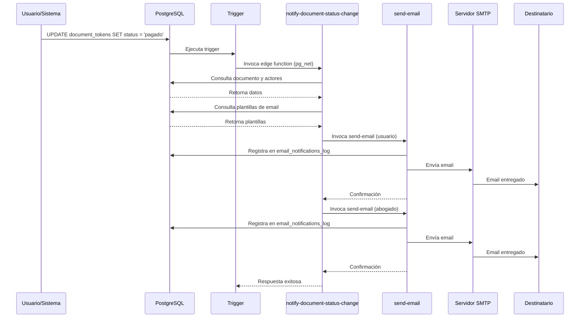

# Sistema de Notificaciones por Email - Tu Consultor Legal

## 📋 Visión General

Este documento describe el flujo completo de notificaciones por email en el sistema de gestión de documentos legales. El sistema asegura que **todos los actores** (usuarios, abogados y administradores) reciban notificaciones apropiadas en cada etapa del ciclo de vida del documento.

---

## 🔄 Ciclo de Vida del Documento y Notificaciones

### Estados del Documento

```
solicitado → en_revision_abogado → revision_usuario → pagado → descargado
```

### Flujo de Notificaciones por Estado

#### 1. **Estado: `solicitado`** (Documento Creado)

**¿Cuándo ocurre?**
- Usuario solicita un documento desde el formulario
- Usuario solicita un documento a través de un agente IA

**Notificaciones enviadas:**
- ✅ **Admin** → Plantilla: `document_requested`
  - Notifica al administrador de la nueva solicitud
- ✅ **Usuario** → Plantilla: `document_confirmation_user`
  - Confirma al usuario que su solicitud fue recibida
  - Incluye: token, precio, fecha estimada, link de seguimiento
- 🤖 **Abogado Creador del Agente** (solo si aplica) → Plantilla: `lawyer_document_from_agent`
  - Notifica al abogado que creó el agente IA
  - Incluye estadísticas del agente

**Variables disponibles:**
- `user_name`, `user_email`
- `document_type`
- `token`
- `price`
- `sla_deadline`
- `tracking_url`
- `site_url`
- `current_year`
- `agent_name` (solo para agentes)
- `total_documents`, `success_rate` (solo para agentes)

---

#### 2. **Estado: `en_revision_abogado`** (Asignado a Abogado)

**¿Cuándo ocurre?**
- Admin o sistema asigna el documento a un abogado específico

**Notificaciones enviadas:**
- ✅ **Abogado Asignado** → Plantilla: `lawyer_new_assignment`
  - Notifica al abogado de su nueva asignación
  - Incluye: información del documento, SLA, link al dashboard
- ✅ **Usuario** → Plantilla: `document_in_review`
  - Informa al usuario que su documento está en revisión

**Variables disponibles:**
- `lawyer_name`
- `document_type`
- `token`
- `user_name`, `user_email`
- `sla_deadline`
- `dashboard_url`
- `current_year`

---

#### 3. **Estado: `revision_usuario`** (Listo para Aprobación)

**¿Cuándo ocurre?**
- Abogado completa la revisión y envía el documento al usuario

**Notificaciones enviadas:**
- ✅ **Usuario** → Plantilla: `document_ready_for_review`
  - Notifica que el documento está listo para revisión
  - Incluye: link de seguimiento, precio, nombre del abogado revisor
- ✅ **Abogado Revisor** → Plantilla: `lawyer_review_completed`
  - Confirma al abogado que su revisión fue enviada

**Variables disponibles:**
- `user_name`
- `document_type`
- `token`
- `lawyer_name`
- `price`
- `tracking_url`
- `site_url`
- `dashboard_url`
- `current_year`

---

#### 4. **Estado: `pagado`** (Pago Confirmado)

**¿Cuándo ocurre?**
- Usuario completa el pago del documento
- Webhook de Bold/DLocal confirma el pago

**Notificaciones enviadas:**
- ✅ **Usuario** → Plantilla: `payment_confirmation_user`
  - Confirma que el pago fue procesado exitosamente
  - Incluye: link de descarga, resumen del pago
- ✅ **Abogado Revisor** → Plantilla: `document_paid`
  - Notifica al abogado que el documento fue pagado

**Variables disponibles:**
- `user_name`
- `document_type`
- `token`
- `price`
- `payment_date`
- `tracking_url`
- `site_url`
- `current_year`

---

#### 5. **Estado: `descargado`** (Documento Descargado)

**¿Cuándo ocurre?**
- Usuario descarga el documento final en PDF

**Notificaciones enviadas:**
- ✅ **Usuario** → Plantilla: `download_confirmation_user`
  - Agradece al usuario por descargar
  - Ofrece servicios adicionales
- ✅ **Abogado Revisor** → Plantilla: `document_downloaded`
  - Notifica al abogado que el usuario descargó el documento

**Variables disponibles:**
- `user_name`
- `document_type`
- `site_url`
- `current_year`

---

## 🔧 Arquitectura Técnica

### 1. Trigger de Base de Datos

```sql
CREATE TRIGGER trigger_notify_document_status_change
AFTER UPDATE ON document_tokens
FOR EACH ROW
WHEN (OLD.status IS DISTINCT FROM NEW.status)
EXECUTE FUNCTION notify_document_status_change();
```

**Funcionamiento:**
- Se ejecuta automáticamente cuando cambia el `status` de un documento
- Llama al edge function `notify-document-status-change` vía `pg_net`
- No bloquea la transacción principal (asíncrono)

---

### 2. Edge Function: `notify-document-status-change`

**Ubicación:** `supabase/functions/notify-document-status-change/index.ts`

**Responsabilidades:**
1. Recibe el cambio de estado del trigger
2. Consulta la configuración de plantillas para ese estado
3. Obtiene información del documento y actores relacionados
4. Genera variables para las plantillas
5. Invoca `send-email` para cada notificación
6. Maneja notificaciones especiales (ej: creador del agente)

**Mapeo de Estados a Plantillas:**

```typescript
const STATUS_TO_TEMPLATE = {
  'solicitado': [
    { key: 'document_requested', recipient: 'admin' },
    { key: 'document_confirmation_user', recipient: 'user' }
  ],
  'en_revision_abogado': [
    { key: 'lawyer_new_assignment', recipient: 'lawyer' },
    { key: 'document_in_review', recipient: 'user' }
  ],
  'revision_usuario': [
    { key: 'document_ready_for_review', recipient: 'user' },
    { key: 'lawyer_review_completed', recipient: 'lawyer' }
  ],
  'pagado': [
    { key: 'document_paid', recipient: 'lawyer' },
    { key: 'payment_confirmation_user', recipient: 'user' }
  ],
  'descargado': [
    { key: 'document_downloaded', recipient: 'lawyer' },
    { key: 'download_confirmation_user', recipient: 'user' }
  ]
};
```

---

### 3. Edge Function: `send-email`

**Ubicación:** `supabase/functions/send-email/index.ts`

**Responsabilidades:**
1. Recibe los parámetros del email
2. Obtiene configuración SMTP de la base de datos
3. Envía el email usando `denomailer`
4. Registra el intento en `email_notifications_log`

---

### 4. Tabla: `email_templates`

**Estructura:**
- `template_key`: Identificador único (ej: `document_confirmation_user`)
- `template_name`: Nombre descriptivo
- `subject`: Asunto con variables `{{variable}}`
- `html_body`: Cuerpo HTML con variables
- `is_active`: Booleano para activar/desactivar
- `variables`: Array JSON de variables disponibles

---

### 5. Tabla: `email_notifications_log`

**Estructura:**
- `to`: Email del destinatario
- `subject`: Asunto del email
- `template_key`: Plantilla utilizada
- `recipient_type`: Tipo de destinatario
- `status`: Estado del envío (`pending`, `sent`, `failed`)
- `sent_at`: Timestamp del envío

---

## 🚀 Flujo Completo de una Notificación



---

## 🧪 Testing y Debugging

### Verificar Logs del Trigger

```sql
-- Ver logs recientes en email_notifications_log
SELECT 
  to,
  subject,
  template_key,
  recipient_type,
  status,
  sent_at,
  created_at
FROM email_notifications_log
ORDER BY created_at DESC
LIMIT 20;
```

### Verificar Edge Function Logs

```bash
# Logs de notify-document-status-change
supabase functions logs notify-document-status-change --limit 50

# Logs de send-email
supabase functions logs send-email --limit 50
```

### Verificar Configuración SMTP

```sql
-- Ver configuración actual de SMTP
SELECT * FROM email_configuration WHERE is_active = true;
```

### Test Manual de Notificación

```sql
-- Cambiar estado manualmente para probar notificaciones
UPDATE document_tokens 
SET status = 'revision_usuario'
WHERE token = 'TU_TOKEN_AQUI';
```

---

## 🛠️ Mantenimiento

### Agregar Nueva Plantilla

1. **Insertar en `email_templates`:**
```sql
INSERT INTO email_templates (
  template_key,
  template_name,
  subject,
  html_body,
  is_active,
  variables
) VALUES (
  'nueva_plantilla',
  'Nueva Plantilla Descriptiva',
  '🔔 {{variable1}}',
  '<html>...</html>',
  true,
  '["variable1", "variable2"]'::jsonb
);
```

2. **Actualizar mapeo en `notify-document-status-change`:**
```typescript
const STATUS_TO_TEMPLATE = {
  'nuevo_estado': [
    { key: 'nueva_plantilla', recipient: 'user' }
  ]
};
```

---

### Desactivar Notificaciones

```sql
-- Desactivar una plantilla específica
UPDATE email_templates 
SET is_active = false
WHERE template_key = 'document_confirmation_user';
```

---

## 🔒 Seguridad

### Variables Sanitizadas

Todas las variables son procesadas por `replaceVariables()` que:
- Escapa caracteres HTML peligrosos
- Previene inyección de código
- Valida formato de datos

### CORS Headers

```typescript
const corsHeaders = {
  'Access-Control-Allow-Origin': '*',
  'Access-Control-Allow-Headers': 'authorization, x-client-info, apikey, content-type',
};
```

---

## 📊 Monitoreo

### Métricas Clave

```sql
-- Tasa de éxito de emails en las últimas 24h
SELECT 
  status,
  COUNT(*) as total,
  ROUND(COUNT(*) * 100.0 / SUM(COUNT(*)) OVER (), 2) as percentage
FROM email_notifications_log
WHERE created_at > NOW() - INTERVAL '24 hours'
GROUP BY status;

-- Emails por tipo de destinatario
SELECT 
  recipient_type,
  COUNT(*) as total
FROM email_notifications_log
WHERE created_at > NOW() - INTERVAL '7 days'
GROUP BY recipient_type;

-- Emails por plantilla
SELECT 
  template_key,
  COUNT(*) as total,
  AVG(CASE WHEN status = 'sent' THEN 1 ELSE 0 END) as success_rate
FROM email_notifications_log
WHERE created_at > NOW() - INTERVAL '7 days'
GROUP BY template_key
ORDER BY total DESC;
```

---

## 🆘 Troubleshooting

### Problema: No se envían emails

**Posibles causas:**
1. Trigger deshabilitado
2. Plantilla inactiva
3. Configuración SMTP incorrecta
4. Edge function con error

**Soluciones:**
```sql
-- 1. Verificar trigger
SELECT * FROM pg_trigger 
WHERE tgname = 'trigger_notify_document_status_change';

-- 2. Verificar plantillas
SELECT template_key, is_active FROM email_templates;

-- 3. Verificar SMTP
SELECT * FROM email_configuration WHERE is_active = true;

-- 4. Ver logs de edge functions (desde CLI)
```

---

### Problema: Emails duplicados

**Causa:** Múltiples invocaciones del trigger

**Solución:**
El sistema está diseñado para manejar esto gracefully. Verificar:
```sql
SELECT * FROM email_notifications_log 
WHERE to = 'email@ejemplo.com'
AND created_at > NOW() - INTERVAL '1 hour'
ORDER BY created_at DESC;
```

---

## 📝 Variables Globales Disponibles

Estas variables están disponibles en **todas** las plantillas:

| Variable | Descripción | Ejemplo |
|----------|-------------|---------|
| `user_name` | Nombre del usuario | "Juan Pérez" |
| `user_email` | Email del usuario | "juan@example.com" |
| `document_type` | Tipo de documento | "Contrato de Arrendamiento" |
| `token` | Token único del documento | "ABC123DEF456" |
| `price` | Precio del documento | "50000" |
| `tracking_url` | URL de seguimiento | "https://tuconsultorlegal.co/#documento?code=..." |
| `site_url` | URL del sitio | "https://tuconsultorlegal.co" |
| `dashboard_url` | URL del dashboard | "https://tuconsultorlegal.co/#abogados" |
| `current_year` | Año actual | "2025" |
| `sla_deadline` | Fecha límite SLA | "lunes, 13 de enero de 2025" |
| `payment_date` | Fecha de pago | "13 de enero de 2025" |
| `lawyer_name` | Nombre del abogado | "Dra. María González" |

---

## 🎯 Mejoras Futuras

- [ ] Sistema de reintentos automáticos para emails fallidos
- [ ] Notificaciones por SMS/WhatsApp
- [ ] Panel de configuración de plantillas en el admin
- [ ] A/B testing de asuntos de email
- [ ] Reportes de engagement (aperturas, clicks)
- [ ] Plantillas multi-idioma

---

## 📞 Contacto

Para soporte técnico relacionado con el sistema de notificaciones:
- Email: soporte@tuconsultorlegal.co
- Documentación: [docs.tuconsultorlegal.co](https://docs.tuconsultorlegal.co)

---

**Última actualización:** 2025-01-13  
**Versión:** 2.0.0
